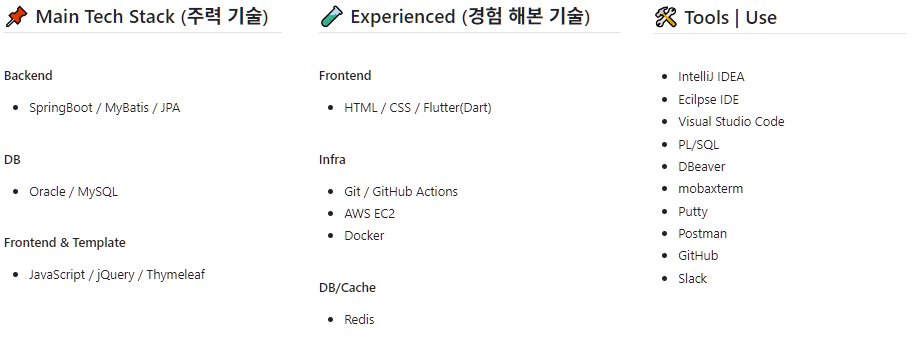

  
   
  <h3>👋 안녕하세요, 끊임없이 성장하는 개발자 최상규입니다.</h3>
  
새로운 기술을 배우고 적용하는 것을 즐깁니다.

 

  
  ## 👨‍💻 나의 정보
  
  **📧Email**
   : bisunesskyu@gmail.com

 

  

  ## 💾 프로젝트
  <table>
    <tr>
      <th>프로젝트명</th>
      <th>기술 스택</th>
      <th>담당 기능</th>
      <th>링크</th>
      <th>영상</th>
      <th>작업 기한</th>
    </tr>
    <tr>
      <td>BNK 1차 팀 프로젝트</td>
      <td>Spring boot / MyBatis / Oracle</td>
      <td>로그인, 회원가입, 마이페이지, 고객센터</td>
      <td><a href='https://github.com/SangKyuuu/busan-bank-project1-team3'>링크</a></td>
      <td><a>링크</a></td>
      <td>25.11-06 ~ 25.12.05</td>
    </tr>
    <tr>
      <td>Shoply 프로젝트</td>
      <td>Spring boot / MyBatis / Oracle </td>
      <td>로그인, 회원가입, 상품등록</td>
      <td><a href='https://github.com/SangKyuuu/Shoply-Project'>링크</a></td>
      <td><a>링크</a></td>
      <td>25.10.01 ~ 25.10.21</td>
    </tr>
    <tr>
      <td>몬스터대학 프로젝트</td>
      <td>Java / JSP / Oracle </td>
      <td>게시판 CRUD</td>
      <td><a href='https://github.com/SangKyuuu/MonsterUniv-Project'>링크</a></td>
      <td><a href='https://www.youtube.com/watch?v=UTVsuxLt-o4'>링크</a></td>
      <td>25.09.01 ~ 25.09.12</td>
    </tr>
  </table>
  

